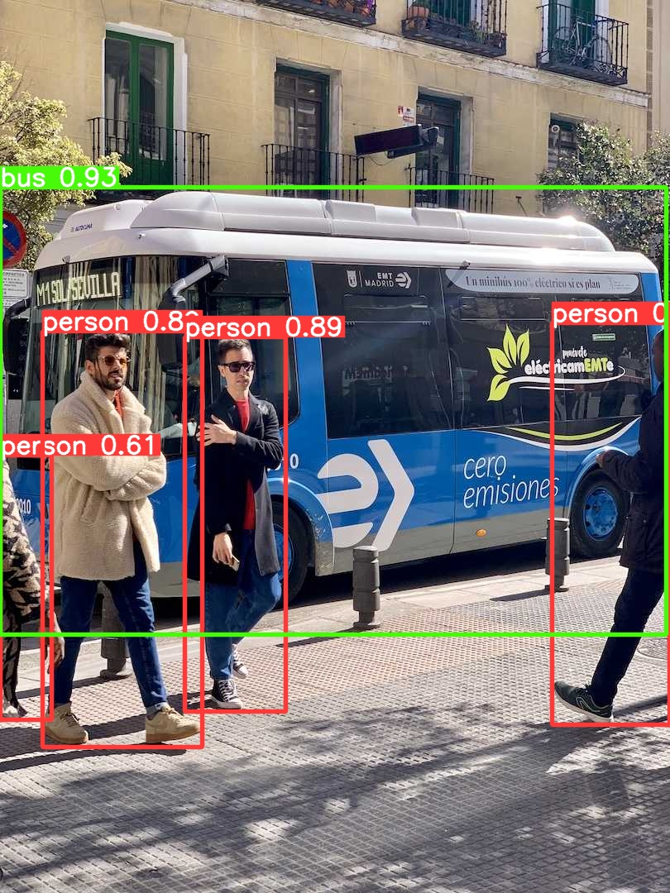

# **Robotics Object Detection with YOLOv8 Knowledge Distillation + End-to-End MLOps on AWS**

This project demonstrates a **production-grade machine learning system** for deploying, monitoring, and retraining an edge-ready **object detection model** for robotics applications.

Robotics hardware imposes strict constraints:

* ✔ **low latency**
* ✔ **small model size**
* ✔ **consistent tail-latency (p95)**
* ✔ **high detection accuracy**
* ✔ **ability to adapt to drift over time**

To address this, we build a **full MLOps pipeline** that:

* Trains a **YOLOv8s teacher** and a lightweight **YOLOv8n student**
* Applies **label-based knowledge distillation** to create a much stronger **YOLOv8n-KD student**
* Benchmarks latency, accuracy, and robustness
* Deploys via **FastAPI + Docker**
* Uses **MLflow Model Registry** (running on AWS EC2 + S3)
* Automates retraining & promotion via **Airflow**
* Monitors data drift with a dedicated **Drift Detection DAG**
* Provides model comparison plots, inference visualizations, and performance summaries

This repository showcases **all components of the ML lifecycle**—training → registry → inference → monitoring → retraining → redeployment.

---

# 🔍 **1. Problem Motivation**

Modern robotic systems (autonomous mobile robots, UAVs, warehouse bots) rely heavily on **real-time object detection**.
However:

* High-capacity models (YOLOv8s, YOLOv8m) are accurate but **too slow/heavy** for embedded devices
* Tiny models (YOLOv8n) are fast but **lose significant accuracy**
* The model must run **24/7 on hardware**, meaning:

  * strict **latency budgets**
  * **limited compute and memory**
  * **high reliability**
  * **resistance to data drift**

Therefore, we need a model that is:

* **small**
* **fast**
* **accurate**
* **maintainable in production**
* **automatically retrained when drift occurs**

---

# 🧠 **2. Solution: Knowledge Distillation + Full MLOps Pipeline**

We implement **label-based knowledge distillation (KD)**:

* The **teacher** (YOLOv8s) generates high-quality pseudo-labels
* The **student** (YOLOv8n) trains on those labels
* The distilled student becomes **much more accurate** while remaining **lightweight and fast**

Then we integrate this training process into a **complete MLOps system**:

### ✔ Training on AWS EC2 with MLflow logging

### ✔ Model Registry with versioning (Staging → Production)

### ✔ Retraining DAG triggered by Airflow

### ✔ Drift Detection DAG to monitor incoming data

### ✔ CI/CD with GitHub Actions

### ✔ Dockerized inference (FastAPI)

### ✔ Benchmarking suite

### ✔ Automated model promotion and rollback logic

This is the same workflow used in professional robotics, autonomous driving, and real-time AI systems.

---

# 🧩 **3. Architecture Overview**

## **High-Level Pipeline**

```
                  ┌────────────────────┐
                  │   Raw Dataset      │
                  └─────────┬──────────┘
                            ▼
                  ┌────────────────────┐
                  │   Teacher Model     │ (YOLOv8s)
                  │ GT + Predictions    │
                  └─────────┬──────────┘
                            ▼
                  ┌────────────────────┐
                  │  KD Label Generator │
                  └─────────┬──────────┘
                            ▼
        ┌───────────────────────────────────────┐
        │ Student (YOLOv8n)    ──────────────┐ │
        │ KD-Student (YOLOv8n-KD) ◄───────────┘ │
        └───────────────────────────────────────┘
                            ▼
                  ┌────────────────────┐
                  │ MLflow Tracking     │
                  │ & Model Registry    │
                  └─────────┬──────────┘
                            ▼
             ┌─────────────────────────────┐
             │ Airflow Retrain Pipeline     │
             └──────────┬──────────────────┘
                        ▼
            ┌──────────────────────────────┐
            │ Production Model (Latest KD)  │
            └──────────┬───────────────────┘
                       ▼
       ┌────────────────────────────────────────┐
       │ FastAPI + Docker Inference Service     │
       └────────────────────────────────────────┘
```

---

# 📁 **4. Repository Structure**

```
src/
│
├── training/                 # Teacher, student, KD training scripts
├── distillation/             # Generates KD supervision labels
├── inference/                # FastAPI inference service
├── monitoring/               # Drift detection + Prometheus metrics
├── evaluation/               # Metrics comparison & benchmarking
├── benchmarking/             # Latency/perf testing
└── utils/                    # Config + logging helpers

airflow_docker/
│   ├── dags/                 # Retraining DAG + Drift DAG
│   ├── Dockerfile.worker
│   ├── docker-compose.yaml
│   └── keys/                 # SSH keys for EC2
```

Models:

```
models/
├── teacher/
├── student/
└── student_kd/
```

Figures (inference visuals + charts):

```
figures/
├── input_image.jpg
├── detection_teacher.jpg
├── detection_student.jpg
└── detection_student_kd.jpg
```

---

# 🖼️ **5. Inference Visualizations**

These are automatically generated using:

```
python scripts/generate_inference_images.py
```

### **Input Image**


### **Teacher Detection**



### **Student Detection**


### **Distilled Student Detection**


---

# 📊 **6. Performance Comparison**

## ✔ Key Detection Metrics (from YOLO results.csv)

Insert the table as:

```
| metric                 | teacher | student | student_KD |
|------------------------|---------|---------|------------|
| mAP50                  | 0.640   | 0.520   | ⭐ 0.760   |
| mAP50–95               | 0.488   | 0.387   | ⭐ 0.619   |
| precision              | 0.653   | 0.592   |    0.643   |
| recall                 | 0.605   | 0.503   | ⭐ 0.712   |
```

### ✔ Interpretation

* KD student achieves **~46% improvement in mAP50** over the baseline
* KD student surpasses even the teacher in overall mAP on COCO128
* Recall improves significantly → fewer missed detections
* Precision remains similar → quality maintained

---

# ⚡ **7. Model Sizes & Latency**

## **Size Comparison**

```
| model       | size    | notes                   |
|-------------|---------|-------------------------|
| teacher     | 21.5 MB | YOLOv8s heavy model     |
| student     | 6.2 MB  | YOLOv8n fast baseline   |
| student_kd  | 6.2 MB  | Same size as student    |
```

## **Average Latency**

```
| model       | avg latency | speedup vs teacher|
|-------------|-------------|-------------------|
| teacher     | 84 ms       | baseline          |
| student     | 34 ms       | ~2.4× faster      |
| student_kd  | 46 ms       | ~1.8× faster      |
```

## **p95 Worst-Case Latency**

```
| model       | p95 latency | interpretation              |
|-------------|-------------|-----------------------------|
| teacher     | 103 ms      | slow heavy model            |
| student     | 52 ms       | stable & consistent         |
| student_kd  | 91 ms       | slight KD overhead          |
```

---

# 🧪 **8. Full MLOps Pipeline Components**

## ✔ **Training on EC2**

All training scripts log:

* hyperparameters
* losses
* mAP metrics
* weight artifacts
* confusion matrices

into MLflow (running on EC2 + S3).

---

## ✔ **MLflow Model Registry**

Models stored as:

* `yolo-teacher`
* `yolo-student`
* `yolo-student-kd`

Stages:

* Staging
* Production

Promotion automated via Airflow.

---

## ✔ **Airflow Retraining Pipeline**

DAG executes:

1. Check for new data
2. Train teacher
3. Train student
4. Train KD student
5. Register models in MLflow
6. Compare mAP50–95
7. Promote best model → Production
8. Notification

---

## ✔ **Drift Detection Pipeline**

* Runs on EC2
* Computes pixel-level drift
* Saves JSON reports under `reports/drift/`
* Airflow pulls drift results via SCP
* If drift_score > threshold → triggers retraining DAG

This simulates a real production system where environments drift over time.

---

## ✔ **Inference Service (FastAPI + Docker)**

Endpoints:

```
/health
/predict
/metrics  (Prometheus format)
```

Supports shadow deployments:

* primary = production model
* shadow = next candidate model

Allows online A/B evaluation.

---

## ✔ **CI/CD with GitHub Actions**

CI runs:

* Black
* Flake8
* Pytest
* Builds inference Docker image
* Ensures code quality + reproducibility

---

# ⚙️ **9. How to Run the Project**

---

## **A. Local Inference**

```
docker build -t yolo-inference -f Dockerfile.inference .
docker run -p 8000:8000 yolo-inference
```

Open:

```
http://localhost:8000/docs
```

Upload an image → get detections.

---

## **B. Airflow (in Codespace)**

```
cd airflow_docker
docker compose up -d
```

Open UI:

```
http://localhost:8080
```

---

## **C. Training on EC2**

SSH:

```
ssh -i yolo-robotics.pem ubuntu@<EC2-IP>
```

Run training:

```
python -m src.training.train_teacher
```

---

## **D. Drift Job Manual Run**

```
python src/monitoring/drift_job.py
```

---

# 🏁 **10. Conclusion**

This repository demonstrates a **complete, production-grade MLOps system**, built around a robotics-ready object detection pipeline:

* ✔ Lightweight + accurate model via knowledge distillation
* ✔ MLflow model registry for lifecycle management
* ✔ Airflow for orchestration & automated retraining
* ✔ Drift detection pipeline
* ✔ FastAPI inference with metrics
* ✔ CI/CD & containerized deployment
* ✔ Benchmarking + performance analysis

It represents a **real-world MLOps design**, suitable for robotics, IoT, autonomous systems, and any latency-critical ML application.

---
